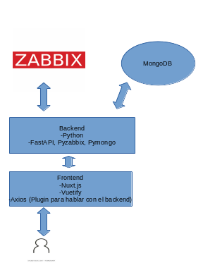

# Lilipad #

### Es un software para medir la capacidad de un centro de datos, ademas de estimar la capacidad futura basada en el consumo de usuarios actuales y futuros extrayendo las metricas del software Zabbix ###
### Es un software escrito en python (backend), y Nuxt.js (frontend) , utiliza MongoDB como Database ###


## Metodo de Utilizacion ##

#### Clonar el repositorio ####
```console
git clone https://github.com/Echenique0702/Lilipad.git
```


#### Database ####
#####  La base de datos usada es MongoDB, por lo cual para las diferentes instalar y configurar escuchando por el puerto 27017 #####


#### Correr en frontend ####

```console
cd Lilipad/web/Lilipad
npm install
npm run dev
```

#### Correr el backend ####

```console
cd Lilipad/api
pip install -r requeriment.txt
source start.sh
```


## Preparacion de Zabbix para el uso del software ##

1. Se debe configurar el template "lilipad.conf" para cada host del centro de datos, este no es mas que las metricas que se deben medir en Zabbix para que el software funcione
2. Ademas se debe agregar el template Template OS Linux  a cada host
3. Los host deben perteneces a alguno de los siguientes grupos ['Proxys', "DNS", "Correo", "Firewalls", 'FTP', "Web", 'Otros']
4. Los servidores tambien seran tratados como hosts (se deben pasar los mismos templates), los cuales seran parte del grupo "Servidores"
5. Se deben crear grupos con los mismos nombres de los servidores, ejemplo: el host Server-1, entonces debe existir un grupo Server-1, donde todos los host que estan alocados en ese servidor deben pertenecer a ese grupo.
6. Los servidores deben tener un tags que su llave sera cpu-frecuency y el valor sera la frecuencia en MHz del CPU.
7. Todos los host deben tener un tags que su llave sera cores y el valos sera la cantidad de nucleos asignados
8. Todos los host deben estar agrupados en dos grupos LXC y KVM en dependencia del hipervisor utilizado.

## Modo de uso ##

### En la pagina de configuracion se debe introducir los datos como se muestra , el Ip de la web de Zabbix, usuario y contraseña, cantidad de usuarios actuales y futuros y el periodo de estimacion de la forma que se muestra en el software ###
### Los resultados seran mostrados en dos tablas la tabla actual que mostrara el consumo actual y la tabla futura que mostrara la estimacion futura de los servicios ###